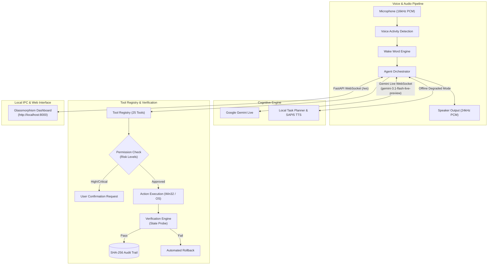

# Nova AI - Production-Grade Voice Desktop Agent

Nova AI is an intelligent, interruptible, observable desktop agent built for Windows. It acts as an autonomous pairing agent, capable of understanding voice and text, breaking complex requests into multi-step workflows, executing desktop automation actions across applications, verifying that those actions succeeded, and speaking the responses in real time.

```
Microphone → Wake Word / VAD → Gemini Live WebSocket → Agent Orchestrator → Tool Registry → Desktop Automation → Verification Engine → Speaker Output
```

---

## Key Capabilities

### 1. Real-Time Bidirectional Voice & Audio
- **Gemini Live WebSocket**: Connected to Google's `gemini-3.1-flash-live-preview` native audio model via the official `google-genai` SDK.
- **Low-Latency Streaming**: Raw PCM 16kHz 16-bit mono input (`audio/pcm;rate=16000`) and 24kHz audio playback.
- **Voice Activity Detection (VAD)**: Real-time RMS energy analysis with silence detection and turn completion.
- **Barge-In / Interruption**: When you speak while the agent is speaking, playback buffer clears in under 10ms and the agent switches immediately to `LISTENING`.
- **Local Degraded Mode**: When offline or if no API key is configured, Nova AI automatically runs an offline task planner with local text-to-speech (`pyttsx3`) via Windows SAPI5.

### 2. Desktop Automation & Action Verification
- **Application Control**: Open, close, focus, and query running processes and GUI windows.
- **Window Management**: Minimize, maximize, restore, and list active windows via Windows Win32 API.
- **Mouse & Keyboard Automation**: Send keystrokes, shortcuts, click coordinates, and scroll.
- **File System**: List directories, read files, write files (with automatic backup rollback), delete files (CRITICAL risk requiring confirmation).
- **Clipboard**: Read and write system clipboard text.
- **Browser Automation**: Open URLs, search Google, navigate bookmarks.
- **System Controls**: Screenshot capture (with base64 visual analysis), volume controls, hardware stats (CPU, RAM, disk, battery), workstation locking.
- **Developer Tools**: Open projects in VS Code, inspect Git status, run safe tests and terminal scripts.
- **Verification Engine**: Every action probes the OS state (e.g. confirming `code.exe` is running, file size > 0, window is focused) before marking a step successful.

### 3. Enterprise Security & Safety
- **Graduated Risk Levels**: `READ_ONLY`, `LOW_RISK`, `MODERATE`, `HIGH_RISK`, `CRITICAL`.
- **Explicit Confirmation**: Destructive operations (file deletion, process termination, system locking) halt execution and prompt the user via an interactive modal with Approve/Reject buttons before proceeding.
- **Execution Sandbox**: Prohibits arbitrary shell scripts; destructive commands (`format`, `diskpart`, `rmdir /s /q c:\`, etc.) are blocked at the perimeter.
- **Cryptographic Audit Trail**: Every action is hashed and recorded in `data/audit.jsonl` using SHA-256 hash chaining to ensure tamper evidence.
- **Secure Local IPC**: WebSocket and REST endpoints with HMAC-SHA256 authentication tokens, rate limiting, and CORS restrictions.

### 4. Polished Modern Glassmorphism Web UI
- Live transcript of user speech and assistant replies.
- Dynamic task execution timeline showing step-by-step checkmarks:
  ```
  Task: Prepare development environment
  ✓ Open VS Code
  ✓ Open project
  → Running tests
  ✓ 28 tests passed
  ```
- Interactive confirmation modal for High-Risk / Critical operations.
- Real-time agent state indicators: `IDLE`, `LISTENING`, `THINKING`, `EXECUTING`, `SPEAKING`, `ERROR`.
- Collapsible tool activity stream and system audit log viewer.

---

## Architecture



---

## Quick Start

### 1. Prerequisites
- Windows 10 or 11
- Python 3.11, 3.12, or 3.13
- Microphone and speakers/headphones (headphones recommended to prevent echo)

### 2. Installation
```bash
# Clone the repository
git clone https://github.com/yourusername/Ai-Voice-Agent.git
cd Ai-Voice-Agent

# Install dependencies
pip install -r requirements.txt
```

### 3. Configuration
Copy `.env.example` to `.env`:
```bash
copy .env.example .env
```
Open `.env` and set your `GEMINI_API_KEY`:
```ini
GEMINI_API_KEY=your_gemini_api_key_here
GEMINI_LIVE_MODEL=gemini-3.1-flash-live-preview
VOICE_NAME=Puck
```
*(Note: If you do not have an API key, Nova AI will start in Local Degraded Mode with offline command planning and local speech synthesis.)*

### 4. Running the Assistant
```bash
python main.py
```
Open your browser to:
```
http://localhost:8000
```

---

## Tool Catalog

Nova AI comes with 25 built-in tools across 9 categories:

| Tool Name | Category | Risk Level | Description |
| :--- | :--- | :--- | :--- |
| `launch_application` | Apps | `LOW_RISK` | Launches an application and verifies process & window |
| `close_application` | Apps | `HIGH_RISK` | Terminates process after confirmation |
| `focus_application` | Windows | `LOW_RISK` | Brings matching window to foreground |
| `list_running_applications` | Apps | `READ_ONLY` | Lists active GUI windows with PIDs |
| `minimize_window` | Windows | `LOW_RISK` | Minimizes an application window |
| `maximize_window` | Windows | `LOW_RISK` | Maximizes an application window |
| `keyboard_type` | Input | `MODERATE` | Types text into active focused window |
| `keyboard_hotkey` | Input | `MODERATE` | Executes key combination (e.g. `ctrl+s`) |
| `mouse_click` | Input | `MODERATE` | Clicks mouse at coordinates |
| `mouse_scroll` | Input | `LOW_RISK` | Scrolls mouse wheel up/down |
| `list_directory` | Files | `READ_ONLY` | Lists contents of directory |
| `read_file` | Files | `READ_ONLY` | Reads text file content safely |
| `write_file` | Files | `MODERATE` | Writes file with automatic backup rollback |
| `delete_file` | Files | `CRITICAL` | Deletes file with safety backup and prompt |
| `open_browser_url` | Browser | `LOW_RISK` | Opens URL in default web browser |
| `web_search` | Browser | `LOW_RISK` | Conducts Google search query |
| `take_screenshot` | System | `READ_ONLY` | Captures screen for multimodal vision |
| `get_system_info` | System | `READ_ONLY` | CPU, RAM, disk, battery metrics |
| `control_system_volume`| System | `LOW_RISK` | Adjusts master volume or mute |
| `lock_workstation` | System | `CRITICAL` | Locks workstation screen |
| `read_clipboard` | Clipboard | `READ_ONLY` | Reads current clipboard text |
| `write_clipboard` | Clipboard | `MODERATE` | Copies text string to clipboard |
| `open_project_in_vscode`| Dev | `LOW_RISK` | Opens folder in VS Code |
| `run_safe_terminal_command` | Dev | `HIGH_RISK` | Executes sandboxed terminal command |
| `custom_echo` | Plugin | `READ_ONLY` | Extensibility template tool |

---

## Running Tests

Run the complete test suite (unit tests, integration tests, and failure injection tests):
```bash
pytest -v
```

---

## Documentation

- [System Architecture](docs/ARCHITECTURE.md)
- [Security & Risk Model](docs/SECURITY.md)
- [Extensibility & Plugin Guide](docs/PLUGINS.md)

---

## License
MIT
