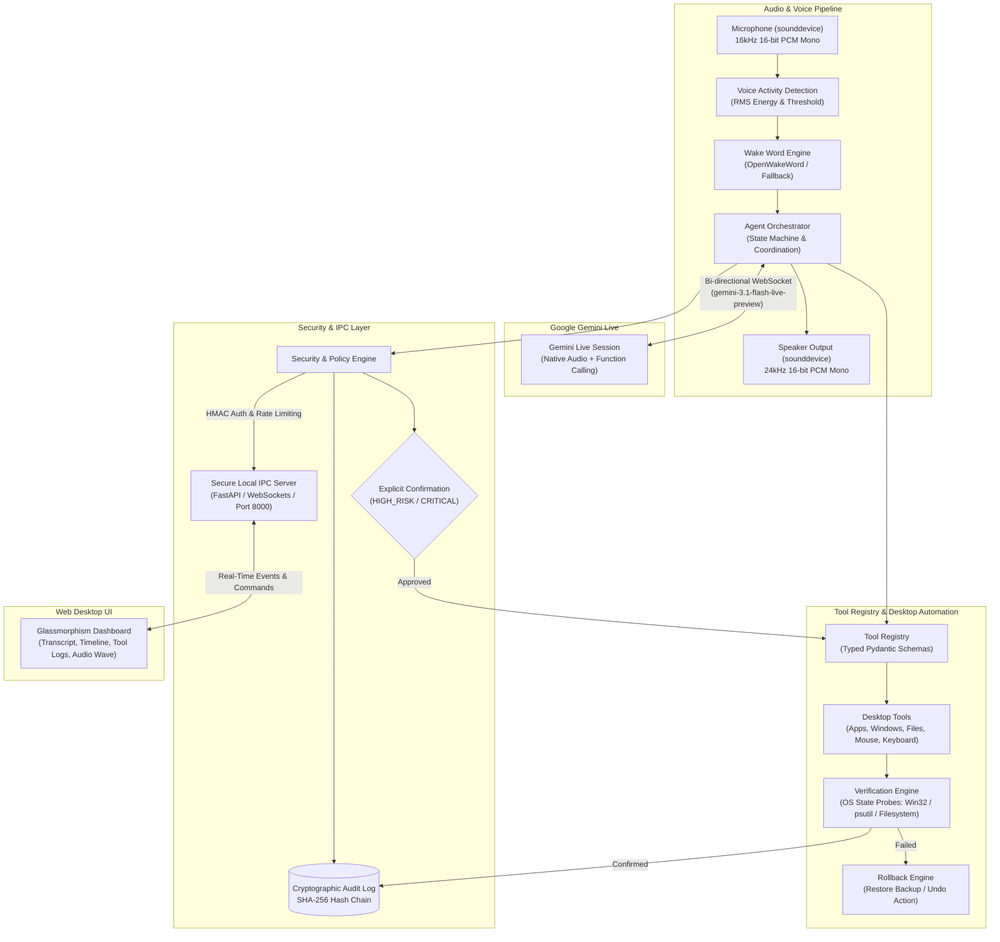
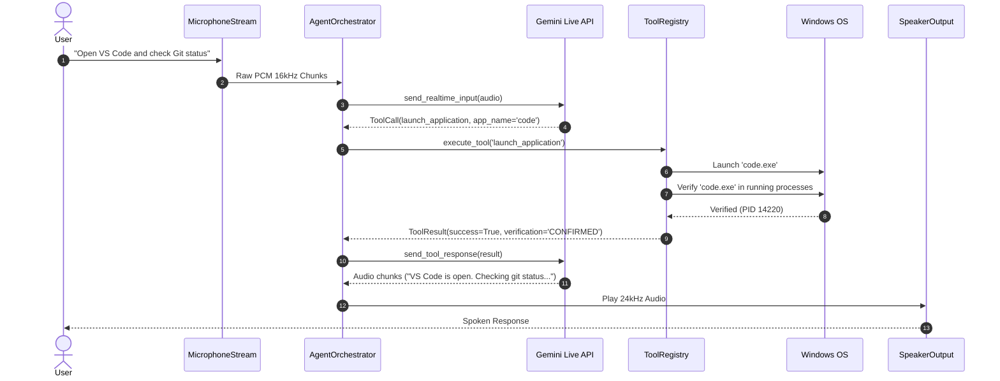

# SHRUTI - Intelligent Voice Desktop Agent: Architecture

SHRUTI is a production-grade, interruptible, observable desktop agent powered by the **Gemini Live WebSocket API** (`gemini-3.1-flash-live-preview`), bidirectional raw PCM audio streaming, an extensible typed Tool Registry, secure local IPC, and an action verification engine.

---

## 1. System Architecture Overview

---

## 2. Core Concepts & Subsystems

### 2.1 Audio Pipeline & Low Latency
- **Input**: `MicrophoneStream` continuously buffers 16kHz, 16-bit, little-endian mono PCM audio (`audio/pcm;rate=16000`).
- **VAD**: `VoiceActivityDetector` measures RMS energy against an adaptive noise threshold, detecting `SPEECH_START`, `SPEECH_CONTINUE`, `SPEECH_END`, and `SILENCE`.
- **Wake Word**: `WakeWordDetector` listens for target activation phrases ("Jarvis", "Gemini", "Computer", "Shruti") and switches the state from `IDLE` to `LISTENING`.
- **Output**: `SpeakerOutput` plays 24kHz raw PCM audio streamed directly from Gemini Live.
- **Barge-In / Interruption**: When user speech is detected while the agent is speaking or Gemini emits `server_content.interrupted`, the speaker buffer is cleared instantly (<10ms latency) and the state transitions back to `LISTENING`.

### 2.2 Gemini Live Integration
- Utilizes the official `google-genai` SDK (`gemini-3.1-flash-live-preview`).
- Synchronous function calling: Tool declarations are dynamically exported from the `ToolRegistry` and passed during connection setup.
- Session Management & Resumption: Exponential backoff reconnects automatically on network drops.
- **Local Degraded Mode**: If offline or no API key is supplied, `LocalPlanner` decomposes natural language requests into multi-step DAGs and executes them with local TTS feedback (`pyttsx3`).

### 2.3 Tool Registry & Execution Pipeline
Every tool implements `BaseTool`:
1. **Schema Validation**: Strongly typed Pydantic parameters.
2. **Permission Check**: Risk levels (`READ_ONLY`, `LOW_RISK`, `MODERATE`, `HIGH_RISK`, `CRITICAL`).
3. **Execution**: Sandboxed execution with timeout and bounded retries.
4. **Verification**: Never assumes success. Probes OS state (process list, active window hwnd, filesystem attributes).
5. **Rollback**: Automatic recovery if verification fails (e.g. restoring backup copy of modified/deleted files).
6. **Audit**: Appended to tamper-evident SHA-256 hash-chained log.

---

## 3. Request Lifecycle

