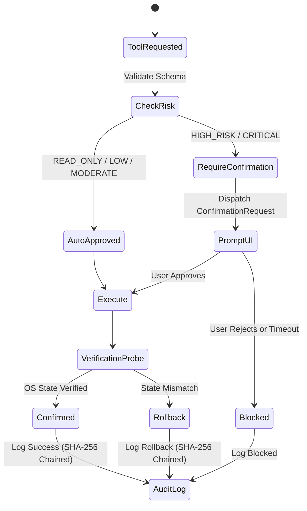

# Nova AI - Security & Permission Architecture

Security and safety are core design pillars of Nova AI. Unlike ordinary voice chatbots, Nova AI operates directly on the user's desktop with access to processes, files, windows, and system controls. Consequently, Nova AI enforces strict multi-layered defense-in-depth principles.

---

## 1. Risk Level Classification

Every tool and action in the system is assigned an immutable risk level:

| Risk Level | Description | Confirmation Required | Example Tools |
| :--- | :--- | :---: | :--- |
| `READ_ONLY` | Passive probes, metrics queries, window inspections, and screenshots. | **No** | `get_system_info`, `list_running_applications`, `list_directory`, `read_file`, `take_screenshot`, `read_clipboard` |
| `LOW_RISK` | Non-destructive UI operations, window focusing, browser navigation. | **No** | `focus_application`, `minimize_window`, `maximize_window`, `open_browser_url`, `web_search`, `control_system_volume` |
| `MODERATE` | Keystroke simulation, mouse clicks, writing new scratch files. | **No** | `keyboard_type`, `keyboard_hotkey`, `mouse_click`, `write_file`, `write_clipboard` |
| `HIGH_RISK` | Process termination, file modification, running developer terminal commands. | **Yes** | `close_application`, `run_safe_terminal_command` |
| `CRITICAL` | Permanent file deletion, workstation lock, system changes. | **Yes (Strict)** | `delete_file`, `lock_workstation` |

---

## 2. Explicit User Confirmation Workflow

When an operation designated `HIGH_RISK` or `CRITICAL` is requested:
1. Execution is **suspended** before any OS call is made.
2. A `ConfirmationRequest` is dispatched with a unique UUID, risk badge, tool name, and parameters.
3. The Web UI displays a prominent confirmation modal with `Approve` and `Reject` buttons.
4. If approved within the configurable timeout (default: 30 seconds), execution proceeds.
5. If rejected or timed out, the action is blocked, logged as `REJECTED`, and reported back to the LLM.

---

## 3. Sandboxed Terminal Execution

Nova AI strictly prohibits the LLM from executing arbitrary or unsanitized shell commands:
- **Command Prefix Whitelist**: Only approved developer utilities (`git`, `npm`, `node`, `python`, `pytest`, `docker`, `pip`, etc.) are permitted.
- **Destructive Command Blacklist**: Destructive patterns (`format`, `diskpart`, `bcdedit`, `reg delete`, `rmdir /s /q c:\`, `del /s /q c:\`) are blocked at the sandbox boundary before execution.
- **Path Traversal Protection**: All file and directory arguments are resolved and validated. System root directories (`C:\Windows`, `C:\Windows\System32`, `C:\Recovery`) cannot be targeted.

---

## 4. Secure Local IPC & Authentication

Communication between the desktop UI, native agents, and the local backend uses:
- **HMAC-SHA256 Token Validation**: Session tokens are signed using a secret key generated at startup or configured in `.env`.
- **Nonces & Expiration**: Tokens contain Unix expiration timestamps and cryptographically random nonces.
- **Sliding-Window Rate Limiting**: The token-bucket rate limiter prevents command flooding or recursive loops.

---

## 5. Tamper-Evident Cryptographic Audit Trail

Every tool invocation, user confirmation, verification outcome, and rollback is recorded in `data/audit.jsonl` with SHA-256 hash chaining:

$$ \text{record\_hash}_n = \text{SHA256}(\text{record\_id} \parallel \text{timestamp} \parallel \text{action} \parallel \text{status} \parallel \text{record\_hash}_{n-1}) $$

The `audit_logger.verify_integrity()` method validates that the entire log has not been altered or truncated.
